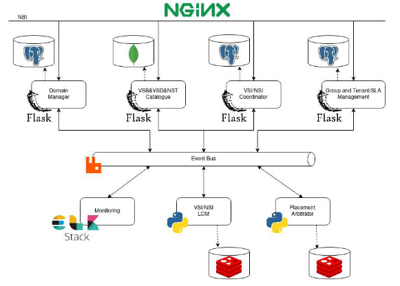

# Network Orchestrator - NetOr

NetOr, consists of an OSS/BSS system that operates over the operator’s 5G infrastructures and services, abstracting  the complex actions required to deploy a network service, as well as infrastructure and network complexities.  

## Architecture

NetOr follows a micro-service and event-driven architecture. Each managed entity in the system is handled by a unique component, which communicates with others through a centralized message bus to exchange event messages. With this architecture, the system is more scalable, flexible, modular, and efficient.

The system is composed of 6 main components: the **VSB/VSD/NST Catalogue**, the **Group/Tenant Manager**, the **Domain Manager**, the **VSI/NSI Coordinator,** the **VSI/NSI LCM Manager**, and the **Placement Arbitrator**.



- **VSB/VSD/NST Catalogue**: This component serves as a persistence service, allowing the creation and onboarding of new descriptors and templates. It also enables the management and deletion of those resources. Its main objective is to provide a centralized entity capable of storing and supplying all the needed descriptors and templates related to vertical services. Those entities are the VSBs, VSDs, NSTs, NSDs, and VNFs. The main entity is the VSB, which serves as a template for the vertical service, defining the topology, QoS parameters, policies, and lifecycle aspects. These blueprints are created by operators to define and expose the services supported by them. Verticals, based on those blueprints, can create VSDs, which are a specification of the predefined service structure, specifying the QoS parameters their scenario requires. Since the vertical services can be composed by network slices or network services, their definitions can also be onboarded in the system, whence the support of NSTs, NSDs, and VNFs.
  As its dependencies, this component needs a MongoDB to persist all managed entities. It also interacts with the centralized RabbitMQ message bus to receive and send the necessary information, and with a centralized IdP system, the Group/Tenant Manager.
- **Group/Tenant Manager**: This component is responsible for handling both the Groups and Tenants of the system, allowing the creation, management, and deletion of both. It serves not only as a persistence service that stores and provides those two entities, but **it is also an IdP for the rest of the system**. This component provides a centralized authentication service for all the system’s users, checking if the tenant exists and if the password matches with the one stored in the system. It must also interact with the centralized RabbitMQ message bus to receive and send the necessary information.
- **Domain Manager**: This component is responsible for managing everything domain-
  related: creation, management, and deletion of domains, and communications handling with the lower level orchestration entities responsible for managing each domain. This component was developed in a modular way, enabling the possibility of having multiple drivers and easily adding new ones. It also interacts with the centralized RabbitMQ message bus to receive and send necessary information and  the centralized NetOr IdP.
- **VSI/NSI Coordinator**: This component is responsible for handling all operations
  related to the high-level VSI, such as its creation, execution of operations during runtime,
  termination, and deletion. It is responsible for triggering the VSI orchestration processes for the rest of the system as well as managing the record associated with each VSI, meaning that this coordinator has all the information about all vertical services, such as their status. In terms of dependencies and interactions, this module needs a PostgreSQL database to store all the information related to the existing VSIs and its composing NSIs and NSs. This component also interacts with the centralized RabbitMQ message bus to receive and send necessary information and with the NetOr centralized IdP system.
- **VSI/NSI LCM Manager**: This component is responsible for managing and coordinating the VSI themselves and possible sub-components, such as NSIs and NSs. For this, **each VSI originates a new management agent that will handle all operations needed to** **be made for that vertical service**. It is that agent that will manage the entire lifecycle of the VSI, and guarantee that the NetOr system has always the most recent information about the service, updating its status regularly.
  In terms of dependencies and interactions, this module needs a Redis instance as a memory cache. This cache serves to persist all relevant runtime information about VSIs, NSIs, and NSs and, once again, it interacts with the centralized RabbitMQ message bus to receive and send necessary information and with the NetOr centralized IdP system. 
- **Placement Arbitrator**:  This component is responsible for processing all the information related to Vertical Services, such as blueprints, descriptors, and templates that configure it to generate the placement information needed, defining the deployment location of each sub-component and possible restrictions. Additionally, it also considers SLAs associated with the tenant and parameters dynamically defined during instantation. By processing all that information, this component can also arbitrate over the VSI and its sub-components. For this, each VSI originates a new agent that will process that information, generate the placement directives, and arbitrate over it, if necessary. In terms of dependencies and interactions with other components, this module also depends on a Redis instance to persist all runtime information about NSIs, NSIs, and NSs in a memory cache. This component must also interact with the centralized RabbitMQ message bus to receive and send necessary information and with the NetOr centralized IdP system. 

## How to run

To run all services, you may use Docker. Firstly, build all services Docker images with the following script:

```
./build_docker_images.sh all
```

 And, start the containers through docker-compose:

```
docker-compose up -d
```


